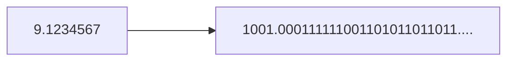

# Chapter 02 변수

### 1. 변수

#### 1.1 변수란?

- 단 하나의 값을 저장할 수 있는 메모리 공간

#### 1.2 변수 선언 및 초기화

```
int age = 25; //변수 age를 선언하고 25로 초기화 한다.
```

#####  초기화 : 처음으로 값을 저장하는 것

#### 1.3 변수의 명명규칙 

**식별자 : 프로그래밍에서 사용하는 모든 이름 **

###### -식별자 필수 규칙

```
1.대소문자가 구분되며 길이에 제한이 없다.
  true와 True는 서로 다름
2.예약어 사용x
  true는 사용불가 True는 가능
3.숫자로 시작x
4.특수문자는 '_', '$'만 사용가능
```

###### -권장 규칙

```
1.클래스 이름의 첫 글자는 항상 대문자
  -변수와 메서드의 이름의 첫 글자는 항상 소문자
2.여러 단어로 이루어진 이름은 단어의 첫글자를 대문자(케멀 스타일)
3.상수의 이름은 모두 대문자,여러 단어인 경우'_'로 구분
  ex) MAX_NUMBER
```

### 2. 변수의 타입

```
기본형(primitive type)
	-논리형(boolean), 문자형(char), 정수형(byte,short,int,long),실수형(float,double)
	계산을 위한 실제 값을 저장한다. 모두 8개

참조형(reference type)
	-객체의 주소를 저장한다. 8개의 기본형을 제외한 나머지 타입
```

참조변수 선언법

```
클래스이름 변수이름;
```

Date클래스 타입의 참조변수 today를 선

ex) Date today = new Date();     //Date 객체를 생성해서, 그 주소를 today에 저장

#### 2.1 기본형(primitive type)

|        | 1 byte  | 2 byte | 4 byte  | 8 byte     |
| ------ | ------- | ------ | ------- | ---------- |
| 논리형 | boolean |        |         |            |
| 문자형 |         | char   |         |            |
| 정수형 | byte    | short  | **int** | long       |
| 실수형 |         |        | float   | **double** |

4개의 정수형중에서 int형이 기본자료형이며, 실수형중에서는 double이 기본 자료형이다.

정수형의 가질 수 있는 값의 범위 **-2^(n-1) ~ 2^(n-1)-1**     n은 비트수

| 자료형 | 저장 가능한 값의 범위 | 정밀도     | bit  | byte |
| ------ | --------------------- | ---------- | ---- | ---- |
| float  | 1.4E-45 ~ 3.4E38      | **7자리**  | 32   | 4    |
| double | 4.9E-324 ~ 1.8E308    | **15자리** | 64   | 8    |

#### 2.2 상수와 리터럴(constant & literal)

**-상수 : 값을 한 번 저장하면 다른 값으로 변경 불가한 저장공간**

`final` 을 변수의 타입 앞에 붙여주면됨 

```
final int MAX_SPEED = 10;  //반드시 선언과 동시에 초기화해야 한다. 
```

**-리터럴 : 그 자체로 값을 의미하는 것**

```
final int MAX_VALUE = 100;
          ---------   --- 
             상수      리터럴
```

#### 리터럴의 타입과 접미사

- long타입의 리터럴 접미사 `L`또는 `l`을 붙임
- 접미사가 없으면 int타입의 리터럴
- byte와 short타입의 리터럴은 별도로 존재x, int타입의 리터럴 사용
- float타입의 리터럴 접미사`f`또는`F`를 붙임
- double타입의 리터럴 접미사`D`또는`d`를 붙임, 기본자료형이라 접미사 생략가능
- 8진수 0, 16진수 0x, 2진수0b 접두사 붙임

```
float pi =3.14;    //float타입변수에 double타입의 리터럴을 사용해서 컴파일 에러가 발생
			       //에러를 수정하기 위해서는 3.14f로 수정해야함
```

**리터럴에 소수점이나 E,e또는 f,F,d,D를 포함하고 있으면 실수형 리터럴로 간주**

| 자료형 | 실수형 리터럴 | 다른 형태의 표현 |
| ------ | ------------- | ---------------- |
| double | 10.           | 10.0             |
| double | .10           | 0.10             |
| float  | 10f           | 10.0f            |
| float  | 3.14e3f       | 3140.0f          |
| double | 1e1           | 10.0             |
| double | 1e-3          | 0.001z           |

**기호 p** : p는 2의 제곱을 의미하며, p의 왼쪽에는 16진수를 적고 오른쪽에는 지수를 10진수 정수로 적는다 ex) **0x1p1 = 16^0 * 1 * 2^1** 

#### 타입의 불일치

- 리터럴 값이 변수의 타입의 범위를 넘어서는 경우
- 리터럴의 타입이 변수의 타입보다 저장범위가 넓은 경우

```
다양한 예시

int i =0x123456789;  //에러 int타입의 범위를 넘는 값을 저장
float f = 3.14;		//에러 float타입보다 double타입의 범위가 넓다.

//byte와 short타입의 리터럴은 따로 존재하지 않고 int타입의 리터럴을 사용하는데.단 변수가 저장할 수 있는 범위에 속해야함.
byte b =65;
short s =0x1234;
```

- 문자 리터럴 : char ch = 'A';                char ch = ' '; 빈 문자 불가능
- 문자열 리터럴  : String name = "Apple";      String name = " "; 빈 문자열 가능

```java
class StringEx{
    public static void main(String[] args) {
        String name= "Ja" + "va";
        String str = name +8.0;
        System.out.println(name);
        System.out.println(str);
        System.out.println(7 + " ");
        System.out.println(" " + 7);
        System.out.println(7 + "");
        System.out.println("" + 7);
        System.out.println("" + "");
        System.out.println(7 + 7+ "");
        System.out.println("" + 7 + 7);
    }
}
```

실행결과


#### 2.3 printf()

| 지시자 | 설명                                        |
| ------ | ------------------------------------------- |
| %b     | boolean형식으로 출력                        |
| %d     | 10진(decimal)정수 형으로 출력               |
| %o     | 8진(octal)정수의 형식으로 출력              |
| %x,%X  | 16진(hexa-decimal)정수의 형식으로 출력      |
| %f     | 부동 소수점(floating-point)의 형식으로 출력 |
| %e,%E  | 지수(exponent) 표현식의 형식으로 출력       |
| %c     | 문자(character)로 출력                      |
| %s     | 문자열(string)로 출력                       |
| %g     | 값을 간략하게 표현                          |

```java
System.out.printf("[%.8s]%n",url);  //왼쪽에서 8글자만 출력
System.out.printf("hex = %#x%n",hex) //hex = 0xffffffffff 
//%x와 %o에 #을 사용하면 접두사 0x,0이 각각 붙는다.
```

```java
double d = 1.23456789;
System.out.printf("d=%14.10f%n",d);  //전체 14자리 중 소수점 아래 10자리
```

|---------------------------------14자리-------------------------------------|

| 1    | 2    | 3    | 4    | 1    | 2    | 3    | 4    | 5    | 6    | 7    | 8    | 9    | 0    |
| ---- | ---- | ---- | ---- | ---- | ---- | ---- | ---- | ---- | ---- | ---- | ---- | ---- | ---- |
|      |      | 1    | .    | 2    | 3    | 4    | 5    | 6    | 7    | 8    | 9    | 0    | 0    |

　　　　    　　　　　|-----------------------10자리----------------------|

#### 2.4 Scanner

```java
import java.util.*;  //Scanner 클래스를 사용하기 위해 추가

Scanner scanner = new Scanner(System.in);  //Scanner클래스의 객체를 생성
String input = scanner.nextLine();  //입력받은 내용을 input에 저장
int num = Integer.parseInt(input);  //입력받은 내용을 int타입의 값으로 변환

int num = scanner.nextInt();  //정수를 입력받아서 변수 num에 저장
```


### 3. 진법

#### 3.2 bit , byte

- bit : 한 자리의 2진수
- 1 bit : 컴퓨터가 값을 저장할 수 있는 최소단위
- 1byte = 8bit
- 1 word = CPU가 한 번에 처리할 수 있는 데이터의 크기
-  32비트 CPU에서 1word = 4byte , 64비트 CPU에서 1word= 8byte

#### 3.3 8진법, 16진법

**1010101100(2) = 1 | 010 | 101 | 100 = 1254(8)  =  10| 1010 | 1100 = 2AC(16)**

#### 3.4 보수법

- 어떤수의 n의 보수란? 더했을 때 n이 되는 수    ex) 7의 '10'의 보수는 3이고 3의 '10'의 보수는 7이다.
-  따라서 2의 보수란 더해서 2가 되는 두수의 관계 -> 2진수로 10  -> 자리올림이 발생하고 0이 되는수

```
2의 보수 = 1의 보수 + 1
```

 

### 4. 기본형(primitive type)

#### 4.1 논리형 -boolean

- true or false 를 저장 할 수있다. 
- default(기본값)은 false이다
- 두 가지의 값만을 표현하기에 1bit만으로 충분하지만 자바에서 데이터의 최소단위가 byte이기에 크기가 1byte다
- 소문자 true, false만 가능, 대문자는 다른 것

#### 4.2 문자형 - char

```
char tab = '\t';  //변수 tab에 탭 문자를 저장
```

| 특수 문자            | 문자 리터럴                        |
| -------------------- | ---------------------------------- |
| tab                  | \t                                 |
| backspace            | \b                                 |
| form feed            | \f                                 |
| new line             | \n                                 |
| carriage return      | \r                                 |
| 역슬래쉬             | \\                                 |
| 작은 따옴표          | \ '                                |
| 큰 따옴표            | \ "                                |
| 유니코드(16진수)문자 | \u유니코드(예 : char a = '\u0041') |

- char타입에 저장되는 값인 유니코드는 모두 양수이므로 0~2^16-1(0~65535)범위를 가짐
- 컴퓨터는 숫자밖에 모르기에 문자가 숫자로 변환되어 저장되고 출력할떄는 문자로 출력됨

#### 인코딩과 디코딩(encoding & decoding)

| 문자 | 유니코드 |
| ---- | -------- |
| A    | 65       |
| B    | 66       |
| C    | 67       |
| ...  | ...      |

'A' ---인코딩----> 65         

'A' <----디코딩--- 65

#### 아스키(ASCII)

- ASCII(American Standard Code for Information Interchange) 정보교환을 위한 미국 표준 코드
- 아스키는 128개(2^7)의 문자 집합을 제공하는 7bit부호
- 처음 32개의 문자는 인쇄와 전송 제어용으로 사용되는 제어문자로 출력할 수 없음
- 마지막 문자(DEL)를 제외한 33번쨰 이후의 문자들은 출력할 수있는 문자들로 기호,숫자,영대소문자로 이루어짐

#### 확장 아스키(Extended ASCII)와 한글

- 데이터는 byte단위로 다뤄지는데 아스키는 7bit, 남는 1bit를 활용해 문자를 추가로 정의한 것이 확장아스키

#### 코드 페이지(code page, cp)

- PC를 사용하는 지역,국가에 따라 여러 버젼의 확장 아스키가 필요함
- IBM은 이들을 code page라 하고 각 코드 페이지에 CP xxx와 같은 형식으로 이름을 붙였다.

#### 유니코드(Unicode)

-  전 세계 모든 문자를 하나의 통일된 문자집합으로 표현한 것
- 2byte로 표현하려했으나 부족하여 21bit로 확장
- 새로 추가된 문자들을 보충문자(supplementary character)라고 하는데 이 문자들을 표현하기 위해서는 char타입이 아닌 int타입을 사용해야함
- 자바는 UTF-16 인코딩을 사용 
- UTF-16은 모든 문자를 2byte 고정크기로 표현 , UTF-8은 하나의 문자를 1~4byte의 가변크기로 표현
- 두 인코딩 모두 처음 128문자가 아스키와 동일
- 유니코드 문자 셋(character set) 이란 유니코드에 포함시키고자 하는 문자들의 집합, 이 문자 셋에 번호를 붙인 것이 유니코드 인코딩
- UTF-16이 문자크기가 동일하기에 다루기는 편리하지만 1byte로 표현할 수 있는 영어와 숫자가 2byte로 표현되므로 문서의 크기가 커진다는 단점이 있다
- UTF-8에서는 영문과 숫자는 1byte 그리고 한글은 3byte로 표현되기 떄문에 문서의 크기가 작지만 문자의 크기가 가변적이므로 다루기 어렵다는 단점이 있다
- 전송속도가 중요하기에 문서의 크기가 작을수록 유리하므로 UTF-8인코딩으로 작성된 웹문서의 수가 빠르게 늘고 있다.

### 4.3 정수형 - byte, short, int, long

#### 정수형의 선택기준

- JVM의 피연산자 스택이 피연산자를 4 byte단위로 저장하기 떄문에 4byte보다 작은 자료형의 값을 계산할 때는 4byte로 변환하여 연산이 수행됨. int를 사용하는 것이 더 효율적
- 정수형 변수를 선언할 때는 **int타입**
- int의 범위를 넘어서는 수는 **long타입**
- 성능보다 저장 공간 절약이 더 중요할 경우 **byte 나 short**사용 

### 4.4 실수형 -float, double

#### 실수형의 선택기준

- 연산속도의 향상이나 메모리를 절약 하려면 **float**
- 더 큰 값의 범위라던가 더 높은 정밀도를 필요로 한다면 **double**

#### 실수형의 저장형식

### **±M×**2^E  

부호(Sign) , 지수(Exponent),가수(Mantissa)


**1. 부호(Sign bit)**

- 부호 비트를 의미하며 1bit
- 1이면 음수 0이면 양수

**2. 지수(Exponent)**

- 지수를 저장하는 부분, **float는 8bit, double은 11bit**의 저장공간을 가짐
- -127~ 128의 값이 저장되는데 이중 -127,128은 NaN, POSITIVE_INFINITY, NEGATIVE_INFINITY와 같은 특별한 값의 표현을 위해 예약되어 있으므로 실제 사용가능한 지수의 범위는 **-126~127**
- float타입으로 표현할 수 있는 **최대값은 2^127, 10진수로 약 10^38**
- 최솟값은 2^-126 x 2^-23(가수의 마지막 자리) = **1.0 x 2 ^-149 , 10진수로 약 10^-45** 

**3. 가수(Mantissa)**

- 실제 값인 가수를 저장하는 부분
- float의 경우 23자리 저장 가능(약 7자리의 10진수 저장 가능 == 정밀도)
- double의 경우 52자리 저장 가능(15자리 10진수 저장 가능)

**저장 법**(9.1234567을 예시로)

1. 2진수 변환



2. 정규화(1.xxx * 2^n형태)

   ```mermaid
   flowchart LR
   	1001.000111111001101011011011-->1.001000111111001101011011011..X2의3승
   ```

3. 저장

   - 1.을 제외한 23자리의 2진수가 가수(M)에 저장되고 그 이후는 잘려나간다.
   - 지수인 3에 기저인 127을 더한 130이 2진수로 변환되어 저장

   | 0    | 10000010     | 00100011111100110101101 |
   | ---- | ------------ | ----------------------- |
   | S    | E(127+3=130) | M                       |


### 5. 형변환

#### 5.1 형변환이란(casting)?

`변수 또는 상수의 타입을 다른 타입으로 변환하는것`

#### 5.2 형변환 방법

- `(타입)피연산자` 형태
- `()` 캐스트 연산자 , 형변환 연산자라고 함
- boolean을 제외한 나머지 타입들은 서로 형변환 가능
- 기본형과 참조형간의 형변환은 불가

#### 5.3 정수간의 형변환

- 큰 타입에서 작은 타입으로 변환 : 값 손실 발생
- 작은 타입에서 큰 타입으로 변환 : 빈 공간은 0 으로 채우고 음수인 경우 1로채운다.

#### 5.4 실수형 간의 형변환

- **float를 double로 형변환 하는 경우**
  - 지수(E)는 float의 기저(127)을 뺸후 double의 기저(1023)을 더해서 변환
  - 가수(M)는 float의 가수 23자리를 채우고 남은 자리를 0으로 채운다.


- **double을 float로 형변환 하는 경우**

  

  - 지수(E)는 double의 기저(1023)을 뺸후 float의 기저(127)을 더해서 변환
  - 가수(M)는 double의 가수 52자리 중 23자리만 저장되고 나머지는 버려짐
  - 가수의 24번째 자리에서 반올림이 발생할 수 있다.
  - float타입의 범위를 넘는 값을 형변환 하면 **±무한대 또는 ±0**을 결과로 얻는다.

#### 5.5 정수형과 실수형 간의 형변환

**정수형을 실수형으로 변환**

- 그저 정수를 2진수로 변환 한 다음 실수 저장형식으로 저장된다.
- 10진수로 8자리 이상의 값을 실수형으로 변환할 때에는 float가 아닌 double사용
  - int는 최대 10자리의 정밀도 요구 하지만 float는 약 7자리 정밀도만 제공

**실수형을 정수형으로 변환**

- 소수점 이하 값은 버려진다. 예) 1.666을 int형으로 변환하면 1
- 버리고 남은 정수가 정수형의 범위를 넘는 경우 오버플로우 발생

#### 5.6 자동 형변환

- 서로다른 타입의 변수간의 연산은 형변환을 하는 것이 원칙이지만 값의 범위가 작은 타입에서 큰 타입으로의 형변환은 생략할 수있다.

```
기존의 값을 최대한 보존할 수 있는 타입으로 자동 형변환한다.
```

###### 자동 형변환이 가능한 방향 


- 왼쪽에서 오른쪽으로의 변환은 자동 형변환
- 반대 방향의 변환은 반드시 형변환 연산자 사용
- char, short은 둘다 2byte지만 char(0~65535), short(-32768~32767) **<u>범위가 서로 달라서 둘 중어느쪽으로의 형변환도 값 손실이 발생</u>**할 수 있으므로 자동 형변환 불가
